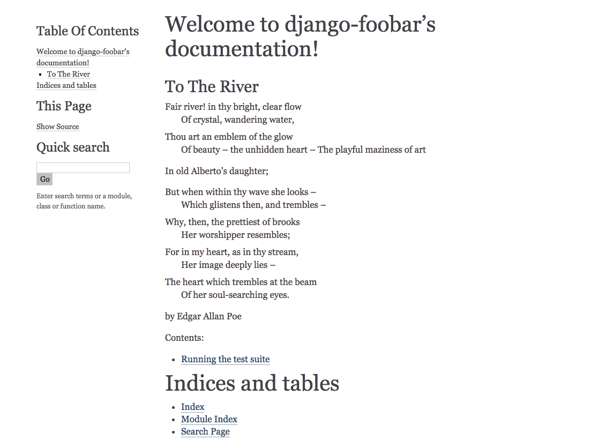

.. _documentation-label:

========================
Documenting your library
========================

If you have followed this guide step-by-step, you should already have a ``docs/`` directory in the projects
working directory containing a `Sphinx <sphinx-doc.org>`_ project. If you skipped that step, now is a good
time to go back and create a :ref:`create-docs-label` project.

Inside the ``docs/`` directory you'll find a file called ``conf.py``. This is the configuration file which
Sphinx use to build the documentation. The most important settings should already be added in there by the
``sphinx-quickstart`` command we used earlier, so we'll just leave that alone.

Writing documentation
=====================

Most of the time, the reason for writing 3rd party modules is that we believe we have found a use case for
some kind of functionality that is so common and/or generic that we can put in some time and effort now, to
save time in the long run. Chances are, that other people might find our module useful too, but we need to
tell them how (and our future selves) to use it.

It is therefore crucial that we write good documentation and explain how to use the code.

Index
-----

Inside the ``docs/`` directory you'll find a file called ``index.rst``. Open it in a text editor and it will
look something like this:

    .. code-block:: rst

        .. test documentation master file, created by
           sphinx-quickstart on Tue Sep  1 15:01:48 2015.
           You can adapt this file completely to your liking, but it should at least
           contain the root `toctree` directive.

        Welcome to django-foobar documentation!
        =======================================

        Contents:

        .. toctree::
           :maxdepth: 2

        Indices and tables
        ==================

        * :ref:`genindex`
        * :ref:`modindex`
        * :ref:`search`

Above the ``Content``, start writing a short introduction for your library. It could be a few lines about the
intended use case, target audience, a poem or something else.

As an exercise, let's document how we can run the test suite for our package. Create a new file called
``01-testing.rst`` next to the ``index.rst`` file and modify the ``.. toctree::`` block so it looks like this:

    .. code-block:: rst

        .. toctree::
           :maxdepth: 2

           01-testing

01-testing
----------

Open the newly created ``01-testing.rst`` file, and write the following code:

    .. code-block:: rst

        Running the test suite
        ======================

        In order to run the test suite for ``django-foobar`` run the following command from the
        cli:

            .. code-block:: none

                $ python setup.py test

        You should see the tests complete without errors!

Let's go through some of the directives we have used above:

    - Headlines
        Sphinx is pretty good at determining headline levels, but you **must** be consistent within the file. It is
        also pretty common to keep a consistent style for the entire documentation project.

            .. code-block:: rst

                ==========
                Headline 1
                ==========

                Headline 2
                ==========

                Headline 3
                ----------

                Headline 4
                ..........

    - ``.. code-block:: none``
        This defines a new code block. The ``none`` argument provided indicates the syntax highlighting we want to
        use. When demonstrating commands to be run, ``none`` is usually a good choice, but Sphinx supports a lot
        of different syntax highlighting, like ``python``, ``ruby``, ``xml`` and so on.

    - Inline blocks
        By using double backticks *``this is an inline block``*, you can create ``inline blocks``. They are
        nice for highlighting important words, class names, and so on.

For a more in-depth guide for writing Sphinx docs, see `this guide <https://pythonhosted.org/an_example_pypi_project/sphinx.html>`_
and the `Sphinx primer <http://sphinx-doc.org/rest.html>`_.

Compile the documentation
=========================

Okay, we have now written some documentation. Let's compile it to HTML.
Run the following command from the ``docs/`` directory.

    .. code-block:: none

        $ make html
        sphinx-build -b html -d _build/doctrees   . _build/html
        Running Sphinx v1.3.1
        loading pickled environment... done
        building [mo]: targets for 0 po files that are out of date
        building [html]: targets for 1 source files that are out of date
        updating environment: 0 added, 1 changed, 0 removed
        reading sources... [100%] 04-documentation
        looking for now-outdated files... none found
        pickling environment... done
        checking consistency... done
        preparing documents... done
        writing output... [100%] index
        generating indices... genindex
        writing additional pages... search
        copying static files... done
        copying extra files... done
        dumping search index in English (code: en) ... done
        dumping object inventory... done
        build succeeded.

Open the ``docs/_build/html/index.html`` file in your web browser.

