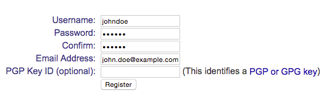

.. _deployment-label:

=================================
Pack and deploy your masterpiece!
=================================

Finally, we're ready to release our little gem into the wild. In order to let users install the library using ``pip``,
we must upload it to the `Python Package Index <https://pypi.python.org/pypi>`_. Head over there and create an
account.

Next, create a new file called ``.pypirc`` in your ``$HOME`` directory. Put the following content in it.
Replace the ``username`` and ``password`` with the ones you used when creating your account.

.. code-block:: none

    # this tells distutils what package indexes you can push to
    [distutils]
    index-servers =
        pypi

    [pypi]
    repository: https://pypi.python.org/pypi
    username: johndoe
    password: <your secret password>

Push the library to PyPi
========================

    .. note::

        This is only meant as a guide line for how to push packages to PyPi. Anybody with a valid account
        can push content there, however; it might not be such a good idea to push all sorts of useless libraries
        out there.

        The ``django-foobar`` library written in this guide is a pretty useless library, so it's no reason
        to actually push it! Use this as a reference when you have written a real library =)

The manifest file
-----------------

The manifest file specifies what files we want to include in the source distribution we're going to upload
to PyPi. Go ahead and create a new file called ``MANIFEST.in`` in your projects working directory and put the
following content in it.

    .. code-block:: none

        include README.rst
        include LICENSE.txt
        include requirements.txt
        include tox.ini
        recursive-include docs Makefile *.rst *.py *.bat
        recursive-include tests *.py *.json *.txt

This is a pretty generic template but will be sufficient for most Django projects. You can read more about the
`MANIFEST.in file here <https://docs.python.org/3/distutils/sourcedist.html#specifying-the-files-to-distribute>`_.

Registering your library
------------------------

If you want to reserve the name for your library, but are not quite ready to distribute it yet you can register
the name on PyPi. We're going to use the ``setup.py`` script we wrote earlier so make sure your current path is
in the projects working directory.

    .. code-block:: none

        (django-foobar):~/django-foobar$ python setup.py register
        unning register
        running egg_info
        writing pbr to django_foobar.egg-info/pbr.json
        writing requirements to django_foobar.egg-info/requires.txt
        writing django_foobar.egg-info/PKG-INFO
        writing top-level names to django_foobar.egg-info/top_level.txt
        writing dependency_links to django_foobar.egg-info/dependency_links.txt
        reading manifest file 'django_foobar.egg-info/SOURCES.txt'
        writing manifest file 'django_foobar.egg-info/SOURCES.txt'
        running check
        Registering django-foobar to https://pypi.python.org/pypi
        Server response (200): OK

Your library are now registered in the Python Package Index!

Uploading your library
----------------------

In order to upload a source distribution, enter the following command:

    .. code-block:: none

        (django-foobar):~/django-foobar$ python setup.py sdist upload
        running sdist
        running egg_info
        writing pbr to django_foobar.egg-info/pbr.json
        writing top-level names to django_foobar.egg-info/top_level.txt
        writing django_foobar.egg-info/PKG-INFO
        writing dependency_links to django_foobar.egg-info/dependency_links.txt
        writing requirements to django_foobar.egg-info/requires.txt
        reading manifest file 'django_foobar.egg-info/SOURCES.txt'
        writing manifest file 'django_foobar.egg-info/SOURCES.txt'
        running check
        creating django-foobar-1.0
        creating django-foobar-1.0/django_foobar
        creating django-foobar-1.0/django_foobar.egg-info
        making hard links in django-foobar-1.0...
        hard linking README.rst -> django-foobar-1.0
        hard linking setup.py -> django-foobar-1.0
        hard linking django_foobar/__init__.py -> django-foobar-1.0/django_foobar
        hard linking django_foobar/admin.py -> django-foobar-1.0/django_foobar
        hard linking django_foobar/models.py -> django-foobar-1.0/django_foobar
        hard linking django_foobar/tests.py -> django-foobar-1.0/django_foobar
        hard linking django_foobar/views.py -> django-foobar-1.0/django_foobar
        hard linking django_foobar.egg-info/PKG-INFO -> django-foobar-1.0/django_foobar.egg-info
        hard linking django_foobar.egg-info/SOURCES.txt -> django-foobar-1.0/django_foobar.egg-info
        hard linking django_foobar.egg-info/dependency_links.txt -> django-foobar-1.0/django_foobar.egg-info
        hard linking django_foobar.egg-info/not-zip-safe -> django-foobar-1.0/django_foobar.egg-info
        hard linking django_foobar.egg-info/pbr.json -> django-foobar-1.0/django_foobar.egg-info
        hard linking django_foobar.egg-info/requires.txt -> django-foobar-1.0/django_foobar.egg-info
        hard linking django_foobar.egg-info/top_level.txt -> django-foobar-1.0/django_foobar.egg-info
        Writing django-foobar-1.0/setup.cfg
        creating dist
        Creating tar archive
        removing 'django-foobar-1.0' (and everything under it)
        running upload
        Submitting dist/django-foobar-1.0.tar.gz to https://pypi.python.org/pypi
        Server response (200): OK

Congratulations, you have just released a 3rd party Django module on PyPi. It may be a little while before the
library is visible for ``pip``.

==========
Conclusion
==========

During this guide, we have been through creating a working environment, how to structure your project, setting up
a test environment suitable for doing Continuous Integration development , writing documentation and deploying the
library to PyPi.

This is by no means a definite solution for all kind of projects, and a lot of topics covered here can be done
in different ways. As you gain experience, you'll probably find things in this guide that doesn't suite your
style of development or other things that work better for you or the project you are working on.

But by now you should be able to a project with a basic workflow that allows other people to contribute.

Have fun!
